# Overview

In this project, we will build  a CI/CD  pipeline from  scraft with  Github Actions and  Azure Pipelines. We will use Github Actions along with a Makefile to perform  to install, verify and test code when submit to Repo Git. Then we will integrate this project with Azure Pipelines to enable Continuous Delivery to Azure App Service.

## Project Plan

* A [link](https://trello.com/b/0loSqcDf/building-a-ci-cd-pipeline) to a Trello board for the project
* A [link](Plan-Project-CI-CD-Worksheet.xlsx) to a spreadsheet that includes the original and final project plan>

## Instructions

* Architectural Diagram 
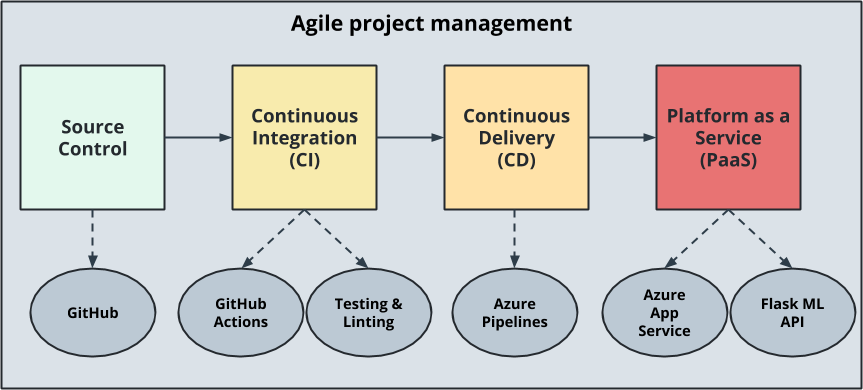


1. Create the Cloud-Based Development Environment

* Create a GitHub Repo sach as below capture
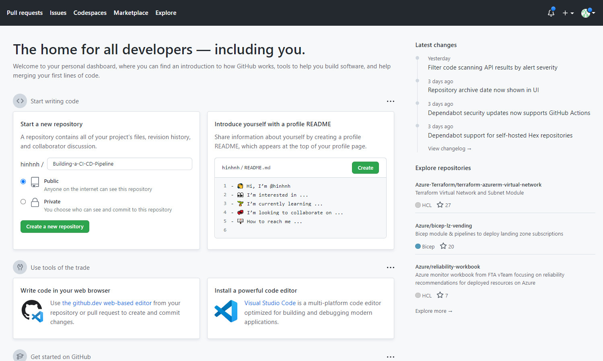

* Create  MakeFile, hello.py, test_hello.py, requirement.txt for GitHubRepo
* Create app.py with Flask framework for for GitHubRepo

* Open Azure Cloud shell
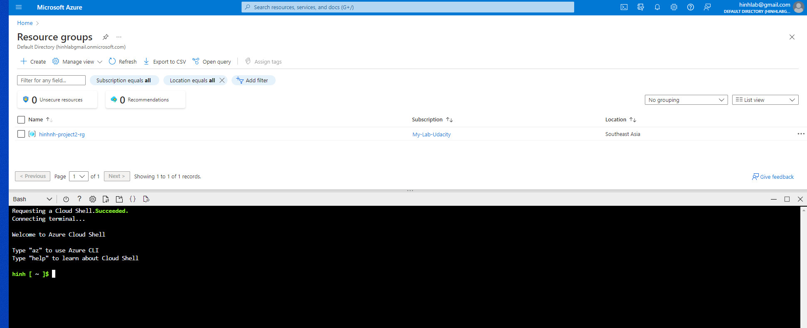

* Create SSH Key by following command:
```
 ssh-keygen -t rsa
```
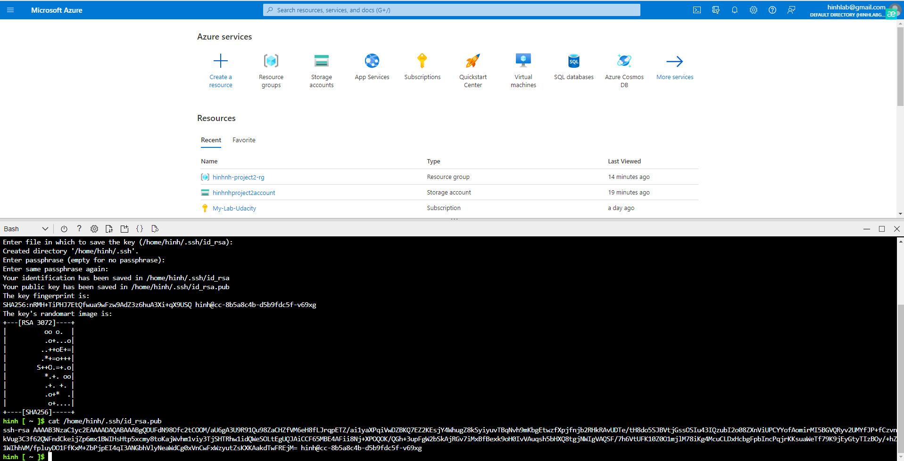

* To show SSH Key we will use below command such as below capture: 
```
cat /home/nguyen/.ssh/id_rsa.pub
```


* Then Copy SHH key and add SSH KEY into setting of GitRepo
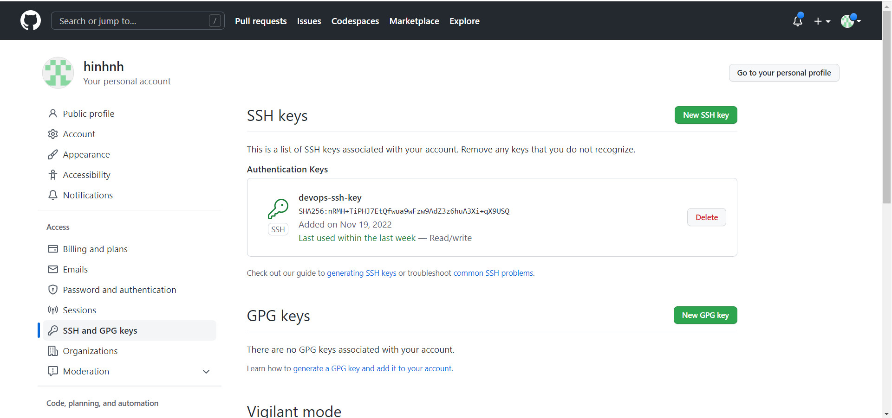

* To run below git command to clone GitRepo to my workpalce:
```
 git clone https://github.com/hinhnh/Building-a-CI-CD-Pipeline.git
```
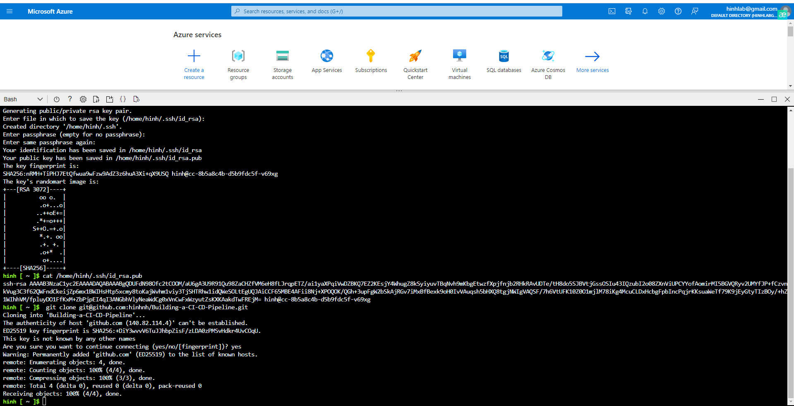

2. Running Make tool by step
 - Navigate to Building-a-CI-CD-Pipeline folder wtith commmad: cd Building-a-CI-CD-Pipeline/
 - Then run command "make all" to to install package, verify and test 
 * Output of a test run
 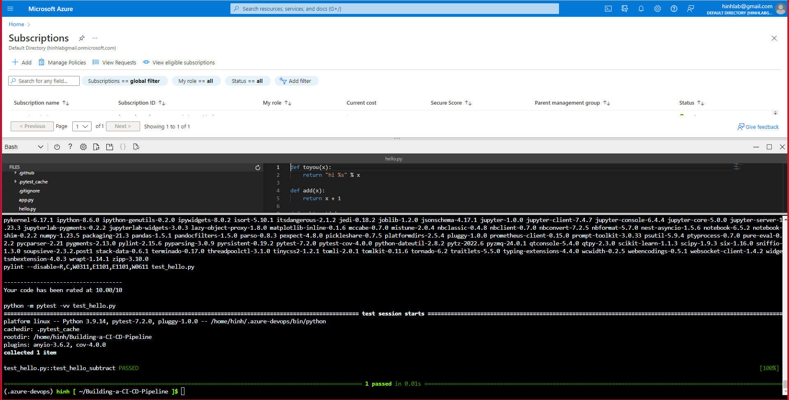

3. Set up Azure Pipelines point to GitHub Repo.  [Note the official documentation should be referred to and double checked as you setup CI/CD](https://docs.microsoft.com/en-us/azure/devops/pipelines/ecosystems/python-webapp?view=azure-devops).
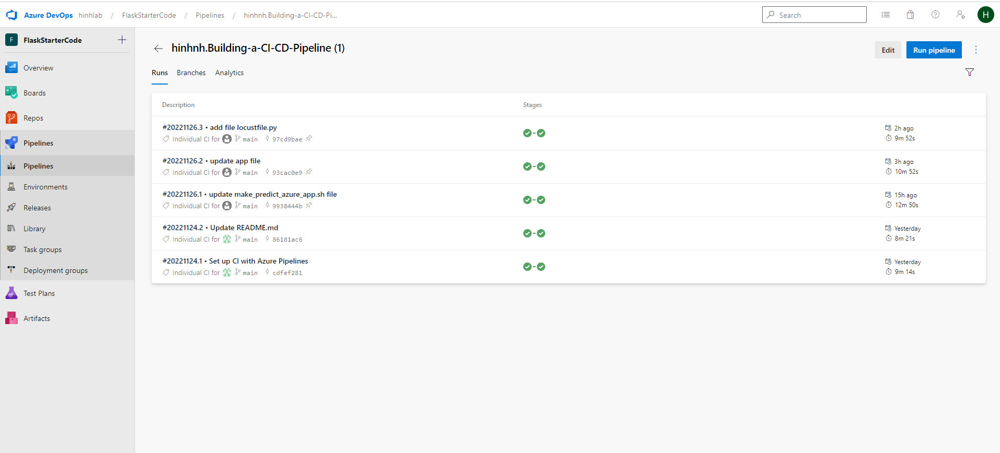

4. Running Azure App Service from Azure Pipelines automatic deployment
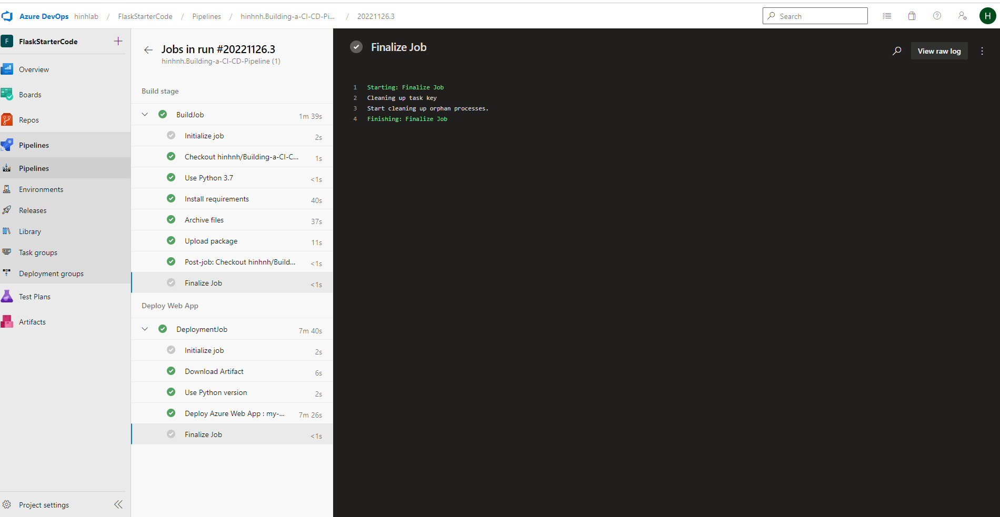


5. Project running on Azure App Service will show like below capture:
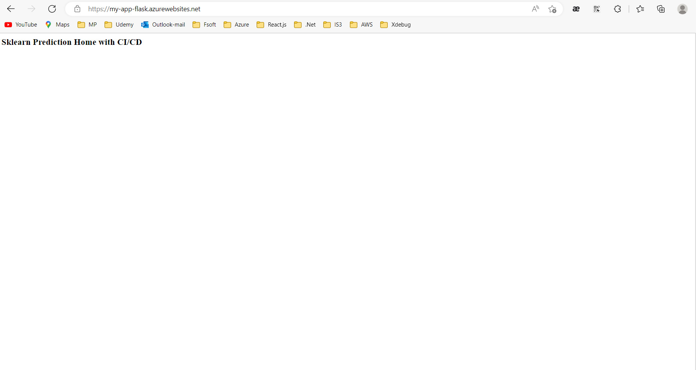


6. To test api prediction from deployed flask app in Azure Cloud Shell.  
.
 The output should show such as below capture:
 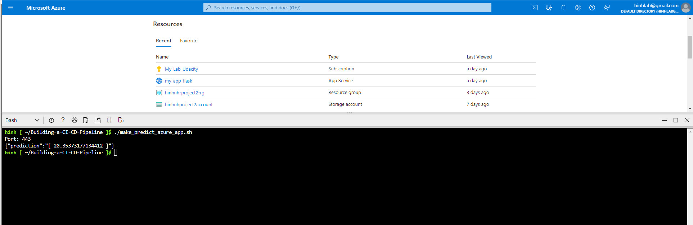
 

 7. To use following command to trace streamed log files from deployed application:
 ```
  az webapp log tail -g hinhnh-project2-rg --name my-app-flask
 ``` 
 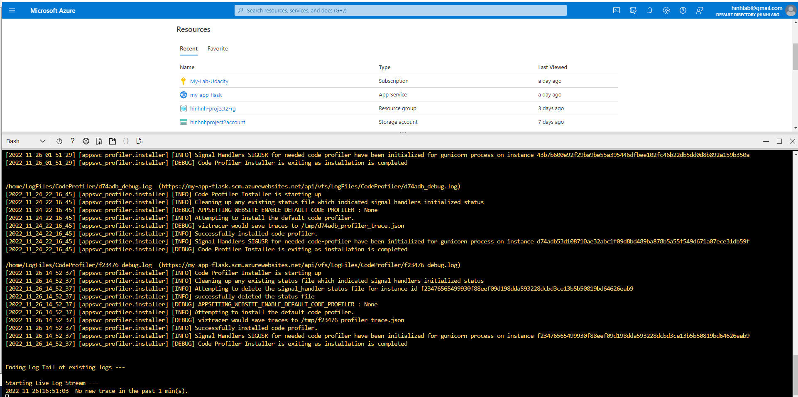

 8.To test App Service with locust using following command:
 ```
  locust --headless --users 8 --spawn-rate 1 -H https://my-app-flask.azurewebsites.net		
 `` 
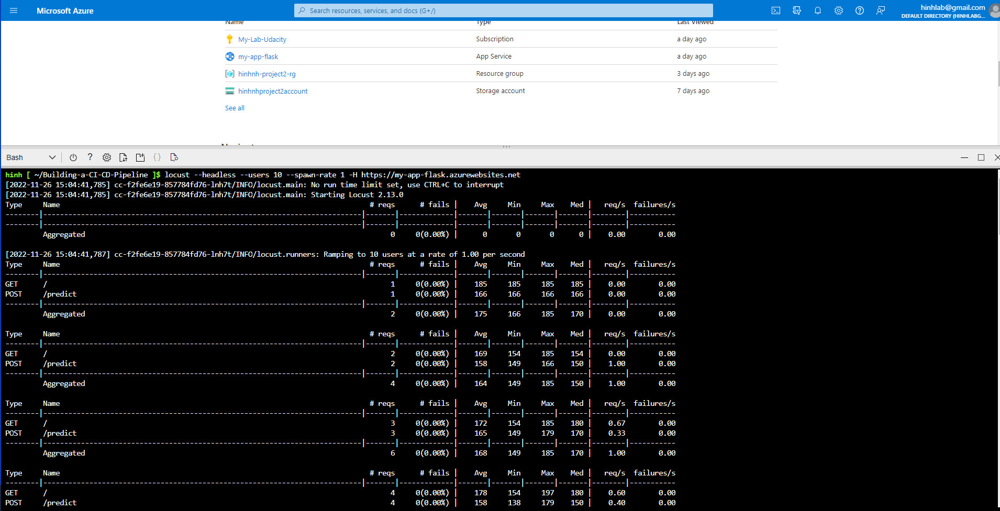


## Demo 

https://www.youtube.com/watch


