 
# Overview

In this project, we will build a CI/CD pipeline from  scraft with  Github Actions and Azure Pipelines. We will use GitHub Actions along with a Makefile to perform  to install, verify and test code when submit to GitHub Repo. Then we will integrate this GitHub Repo with Azure Pipelines to enable Continuous Delivery to Azure App Service.

## Project Plan

* A [link](https://trello.com/b/0loSqcDf/building-a-ci-cd-pipeline) to a Trello board for the project
* A [link](Plan-Project-CI-CD-Worksheet.xlsx) to a spreadsheet that includes the original and final project plan>

## Instructions

* Architectural Diagram 


1. Create the Cloud-Based Development Environment

* Create a GitHub Repo such as below capture
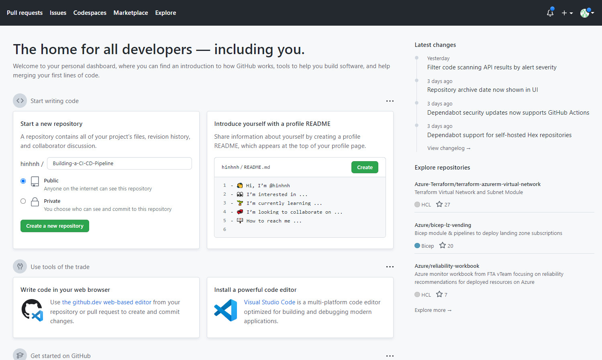

* Create  MakeFile, hello.py, test_hello.py, requirement.txt in GitHub Repo
* Create app.py with Flask framework in GitHub Repo

* Open Azure Cloud shell
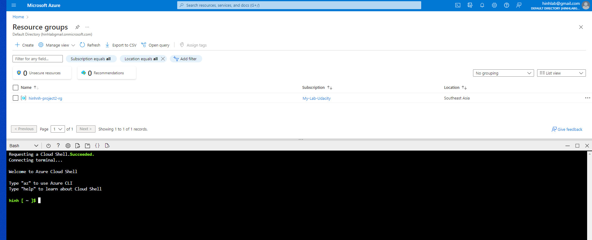

* Create SSH Key by following command:
```
 ssh-keygen -t rsa
```

* To show SSH Key we will use below command: 
```
cat /home/nguyen/.ssh/id_rsa.pub
```


* Then Copy SSH Key and add SSH Key into setting of GitHub Repo
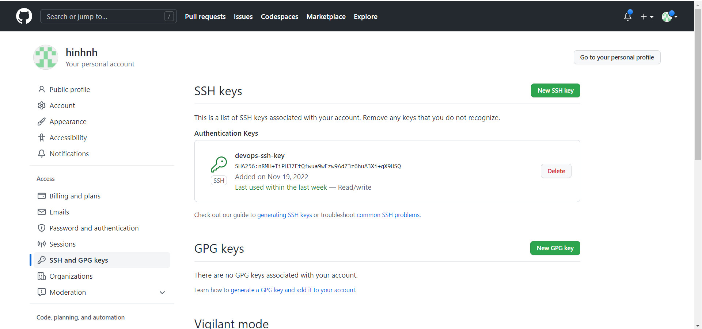

* Then run below git command to clone GitRepo to my workpalce:
```
 git clone https://github.com/hinhnh/Building-a-CI-CD-Pipeline.git
```
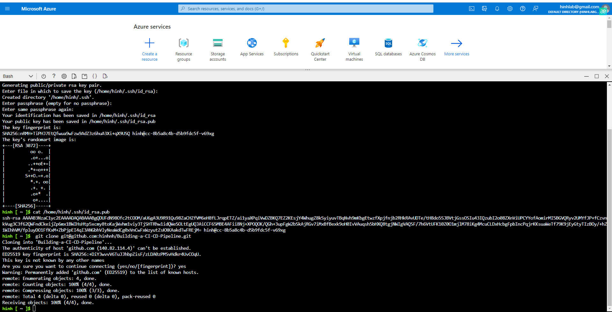

2. Running Make tool by step
 - Navigate to Building-a-CI-CD-Pipeline folder wtith commmad: cd Building-a-CI-CD-Pipeline/
 - Then run command "make all" to to install package, verify and test 
 * Output of test running
 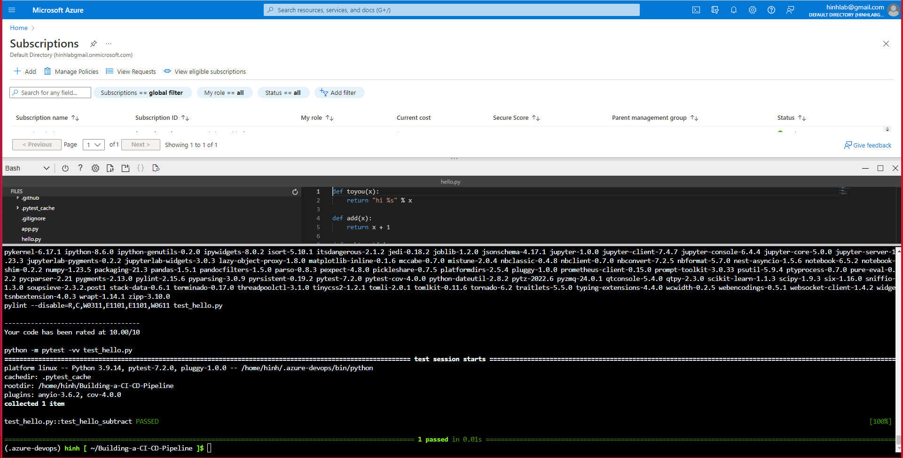
 
3. Set up Azure Pipelines connect to GitHub Repo, we will have Pipeline such as below capture. [Note the official documentation should be referred to and double checked as you setup CI/CD](https://docs.microsoft.com/en-us/azure/devops/pipelines/ecosystems/python-webapp?view=azure-devops).
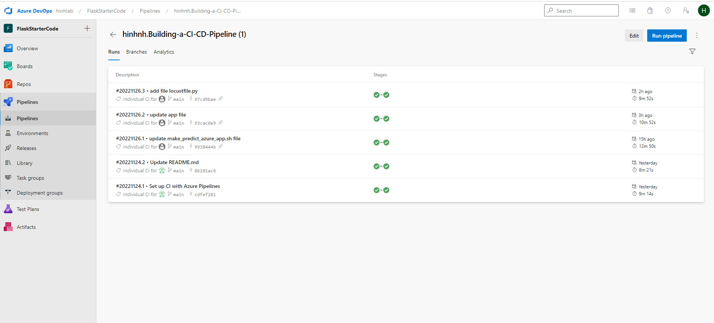

4. Running Azure App Service from Azure Pipelines automatic deployment
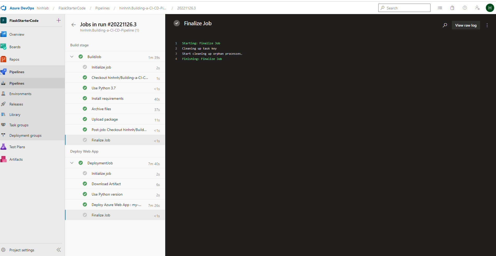


5. Project running on Azure App Service will show like below capture:
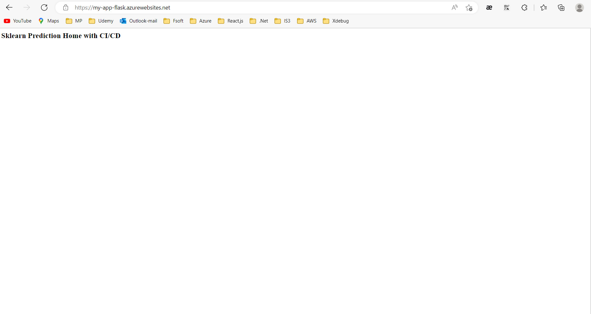


6. To test api prediction from deployed flask app in Azure Cloud Shell.  
[Use this file as a template for the deployed prediction](https://github.com/udacity/nd082-Azure-Cloud-DevOps-Starter-Code/blob/master/C2-AgileDevelopmentwithAzure/project/starter_files/flask-sklearn/make_predict_azure_app.sh). The output should show such as below capture: 
 ```
 bash
 $ ./make_predict_azure_app.sh
 ```
 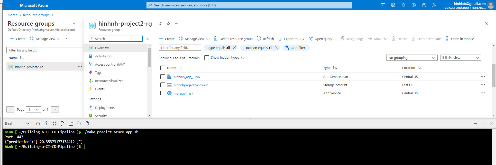
 
7. To use following command to trace streamed log files from deployed application:
 ```
  az webapp log tail -g hinhnh-project2-rg --name my-app-flask
 ``` 
 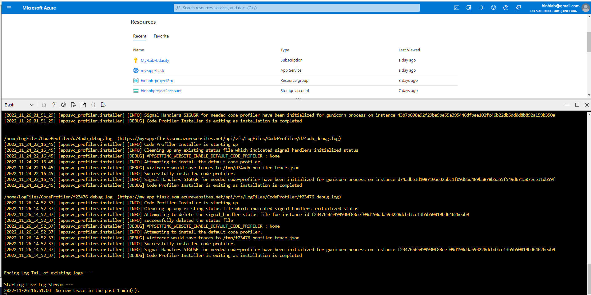

8. Output of locust load test 
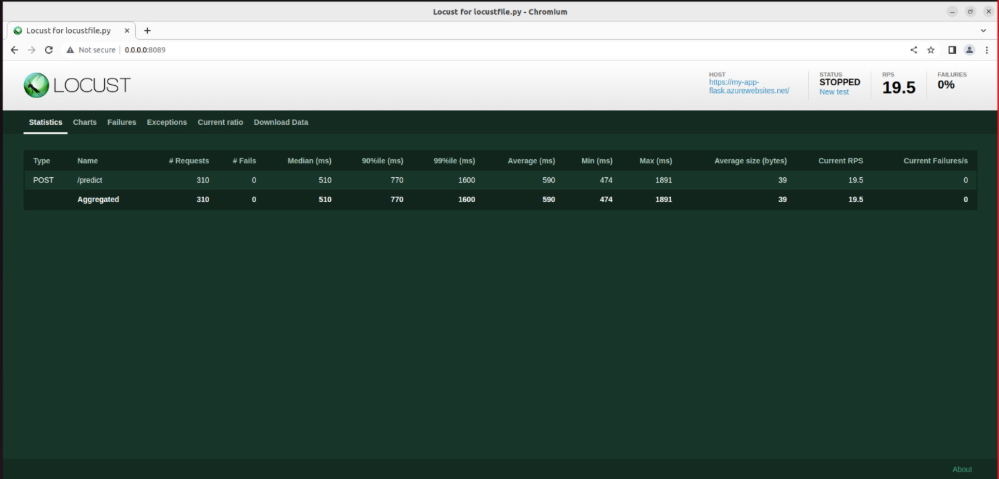

## Enhancements

In this project we only use one pipeline for one branch, in real life we need different branches for different environments so that we need:
* Create terraform file to apply IaC
* Create template then can create environment pipelines with ease
So that each environment we have a set of resources and its own pipeline. Developer just merge the code to target branch, don't have to care about build, test, deploy,...

## Demo 
[Click here to view demo](https://youtu.be/0i7VeX6YbyA)


